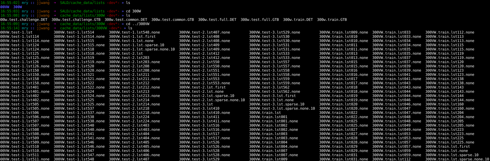

# [Teacher-Student Asynchronous Learning with Multi-Source Consistency for Facial Landmark Detection]:(https://arxiv.org/abs/2012.06711)

## Introduction
The high cost of labeling key points on the face in the video has attracted wide attention from researchers.Existing methods based on semi-supervised learning are dedicated to mining high-quality pseudo-labels and let them continue to participate in training.This self-training method is highly dependent on the quality and quantity of the added pseudo-labels. Therefore, we propose a teacher-student asynchronous learning (TSAL) framework based on mining the consistency of multi-source supervisied signals instead of simply voting. During the training process, TSAL focuses on mining the commonality and specificity between different forms of pseudo-labels under the same task, which produces more reliable pseudo-labels for unlabeled data and boost the performance of self-training. 
## Highlights

* Multi-Source Signals Fusion：Using facial centroid and landmark offsets to the center as one kind of supervision signal to train the model on the unlabeled video data in semi-supervised way. Using facial heatmap as the other kind of supervision signal to train the model with unlabeled video data. As for the fusion way of two detection-based supervision signals, we introduce a asynchronous learning framework.
* Consistency of Detection and Tracking: Tracking method provides more stable and robust results on video, but training tracking model needs much more annotation than detection facial landmark. Therefore, proposed TSAL framwork maintain the consistency between detection and tracking, which finds a best trade-off between detection and tracking results.
* A more resonable facial structure invariant constraint was introduction to maintain stability of facial landmarks.


## How to use?

### Environment Requirements

- PyTorch == 1.4.0
- Python==3.6.7

### Data Preparation

You can find the data preparation method in **cache_data**.

### Annotation Format

After last step, you have made dataset annotation file in cache_data directory. Each dataset has its own label information. Just like this:



Each row in each file represents one face in correspond image or video. As the format of SBR, information of one line means:

```
300W and 300VW: path_of_img, path_of_annotation, x1, y1, x2, y2 
```

```
AFLW: path_of_img, path_of_annotation, x1, y1, x2, y2, face_size
```

### Training Details

You can adjust optimizer config in configs/SGD.config or configs/optimizer.config

You can adjust model config in config/Detector.config

You can adjust facial tracking model config in config/MFDS.json

#### Tracking-based facial landmark detection model Download

We need train a facial landmark detection model based on tracking in semi-supervised way with the help of classic detection-based model, therefore, you can download the pre-trained tracking model: [MFEM_student.tar](https://drive.google.com/file/d/1psVlGYZe1jefxqMQjYxpSb4rozVfHfBc/view?usp=sharing) and [MFEM.tar](https://drive.google.com/file/d/1ZCrDFTlpdBy5pNb5QqrJl7fhfFtL-KNp/view?usp=sharing)

#### Tracking-based facial landmark detection model path setting

Once you have download the tracking-based model, put them in the $root/flowweight

#### Training Command Example

```
CUDA_VISIBLE_DEVICES=2 python ./exps/main.py \
                       --train_lists cache_data/lists/300W/300w.train.DET\
                       --eval_vlists ./cache_data/lists/300VW/300VW.test-3.lst562 \
                       --eval_ilists ./cache_data/lists/300W/300w.test.common.DET \
                                     ./cache_data/lists/300W/300w.test.challenge.DET \
                                     ./cache_data/lists/300W/300w.test.full.DET \
                       --num_pts 68 \
                       --model_config ./configs/Detector.config \
                       --opt_config ./configs/SGD.config \
                       --save_path ./snapshots/Dualmodel_SIC_MFDS_lambda0.7_epoch70 \
                       --pre_crop_expand 0.2 \
                       --sigma 6 \
                       --batch_size 2\
                       --crop_perturb_max 30\
                       --rotate_max 20 \
                       --scale_prob 1.0 \
                       --scale_min 0.9 \
                       --scale_max 1.1 \
                       --scale_eval 1 \
                       --heatmap_type gaussian
```

## Demo

After train the dual-model, you can fetch the similar results of teacher model and student model just like [Teacher](https://youtu.be/HwdoKyxuHsk) and [Student](https://youtu.be/dDgJbw-J-gc) here. 

## License

TSAL itself is released under Apache-2.0 License (refer to the LICENSE file for details).

## Acknowledgements

* CenterNet: Object as point. [CenterNet](https://github.com/xingyizhou/CenterNet) from Xingyi Zhou, Dequan Wang, Philipp Krähenbühl.
* SBR:An Unsupervised Approach to Improve the Precision of Facial Landmark Detectors. [supervision-by-registration](https://github.com/facebookresearch/supervision-by-registration) from Xuanyi Dong, Shoou-I Yu, Xinshuo Weng, Shih-En Wei, Yi Yang, Yaser Sheikh.

## Citation

If you find this project useful for your research, please use the following BibTeX entry.

```
@inproceedings{TSAL_MRY,
  title={Teacher-Student Asynchronous Learning with Multi-Source Consistency for Facial Landmark Detection},
  author={MengRongye, ZhouSanping, WangJinjun},
  booktitle={},
  year={2020}
}
```


